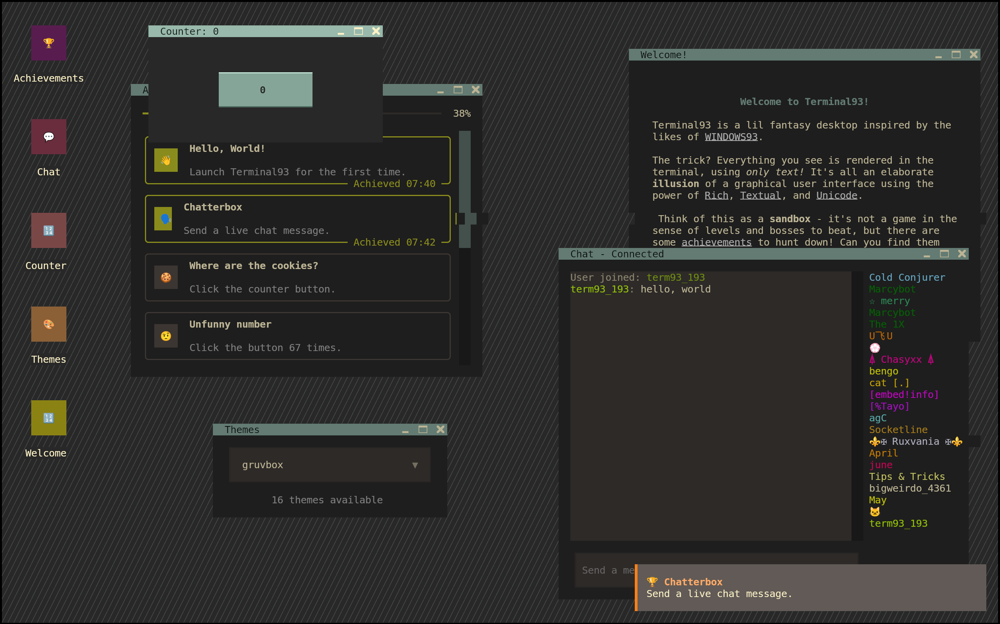

## Welcome to Terminal93!



Terminal93 is a lil fantasy desktop inspired by the likes of [WINDOWS93](https://www.windows93.net/).

The trick? Everything you see is rendered in the terminal, using _only text!_ It's all an elaborate **illusion** of a
graphical user interface using the power
of [Rich](https://rich.readthedocs.io/en/stable/introduction.html), [Textual](https://textual.textualize.io/),
and [Unicode](https://home.unicode.org/).

Think of this as a **sandbox** - it's not a game in the sense of levels and bosses to beat, but there are some *
*achievements** to hunt down! Can you find them all?

Have fun~

— ⚝

## How to run

The recommended way to run Terminal93 for the best experience possible is **in your actual terminal**. If this is
convenient for you to do, then launch Terminal93 with the following command:

```shell
uvx git+https://github.com/ThatOtherAndrew/Terminal93
```

If you don't have [uv](https://docs.astral.sh/uv/) installed, then the following pip command can be used as well:

```shell
pip install git+https://github.com/ThatOtherAndrew/Terminal93
terminal93
```

For convenience, I'm hosting a browser version of Terminal93 as well, which you can try out
at [https://terminal93.fly.dev](https://terminal93.fly.dev) - but keep in mind that this may not be fully supported and
can have funky side effects (e.g. connection limits).
